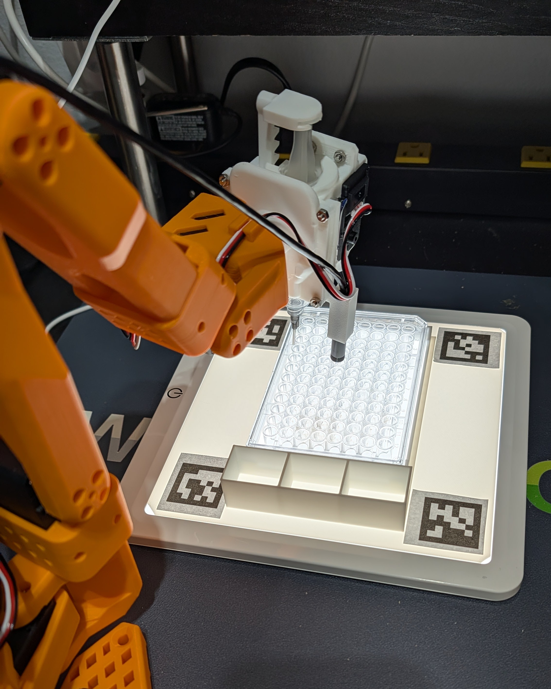

This is a liquid handler end-effector for the [LeRobot SO-101 arm ($299 assembled)](https://shop.wowrobo.com/products/so-arm101-diy-kit-assembled-version-1?variant=46588641607897). It's just an autosyringe that's driven by the SO-101's gripper servo. 

Here's [a video](https://photos.app.goo.gl/v5fZZhvwzL1mopgE7) of it working

It uses the [ST3215 serial bus servo](https://www.dfrobot.com/product-2962.html) that comes with the SO-101 arm and a standard [10ml syringe](https://www.amazon.com/dp/B0F6BLVJH6?ref_=ppx_hzsearch_conn_dt_b_fed_asin_title_5&th=1). Use M3x10mm bolts and nuts to assemble.

You can also add an optional [endoscope camera](https://www.dfrobot.com/product-2328.html) mount so you can see what it's working on

To help the camera see what's in the wells, the 96-well plate is held on a [cheap USB light table](https://amzn.to/47X2aJM). The STL file for the frame that holds the 96-well plate on the light table is [here](96well_plateholder.stl). 
