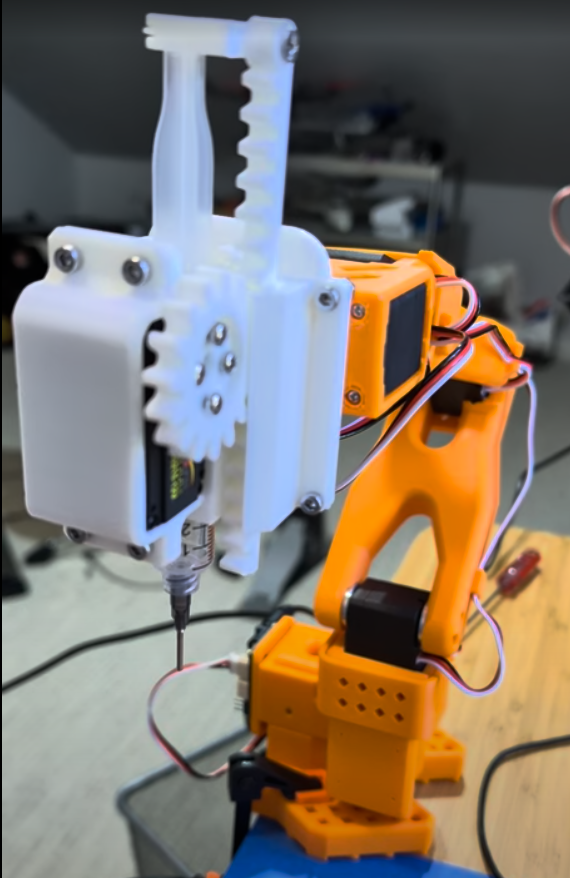
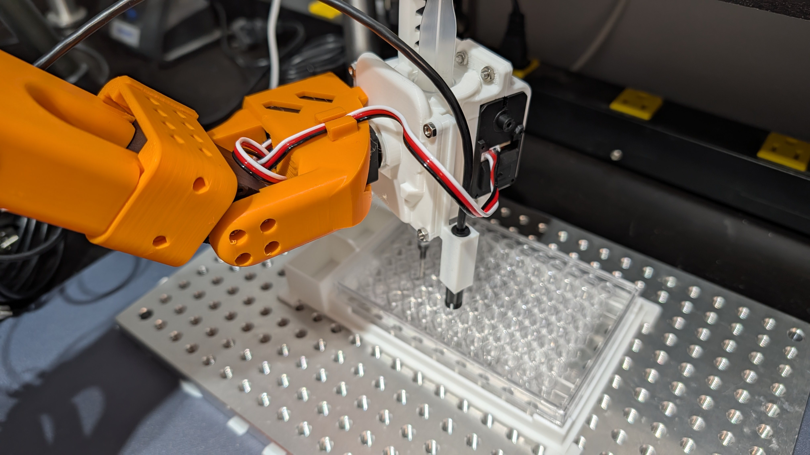

This is a liquid handler end-effector for the LeRobot SO-101 arm. It's just an autosyringe that's driven by the SO-101's gripper servo. 

Here's [a video](https://photos.app.goo.gl/v5fZZhvwzL1mopgE7) of it working

It uses the [ST3215 serial bus servo](https://www.dfrobot.com/product-2962.html) that comes with the SO-101 arm and a standard [10ml syringe](https://www.amazon.com/dp/B0F6BLVJH6?ref_=ppx_hzsearch_conn_dt_b_fed_asin_title_5&th=1)

You can also an an optional [endoscope camera](https://www.dfrobot.com/product-2328.html) mount so you can see what it's working on

